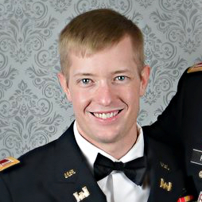

I'm Cassidy, a web developer located in the Washington, D.C. area. I'm a future graduate of the General Assembly web development program, and I finish up my immersive course in January 2016. I'm currently searching for a company with a strong development program for their junior developers, in order to help grow my skills.

I've been studying both front and backend programming languages such as HTML, CSS, JavaScript with jQuery, Node, Angular, Express, Ruby on Rails, PostgreSQL, MongoDB, and development methodologies with an emphasis on Agile development, pair programming, and team projects.
